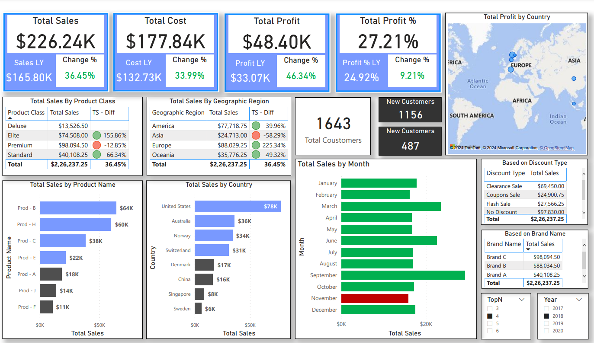

# Optimizing Sales Strategies and Enhancing Customer Experience

## Background
In the dynamic landscape of sales and marketing, data-driven insights play a pivotal role in shaping strategic decisions, enhancing operational efficiency, and fostering customer satisfaction. Modern businesses rely on comprehensive analyses of sales performance, customer feedback, operational metrics, and market trends to stay competitive and drive sustainable growth. By leveraging diverse datasets encompassing sales transactions, product details, location information, discount strategies, sales channels, targets, and complaints/returns, companies can unlock valuable insights to refine their sales strategies and elevate the overall customer.

## Problem Statement
The primary objective of this project is to conduct an integrated analysis of multidimensional datasets to optimize sales strategies and enhance customer experience. By synthesizing insights from sales data, customer feedback, operational metrics, and market dynamics, the aim is to identify actionable recommendations that drive revenue growth, improve customer satisfaction, and streamline operational processes.

## Key Features:
1.	Sales Id: Unique identifier for each sale transaction.
2.	Sales Date: Date when the sale occurred.
3.	Customer Type: Type of customer making the purchase.
4.	Sales Channel: The channel through which the sale was made.
5.	Channel Id: Unique identifier for the sales channel.
6.	Channel Type: Type of sales channel (e.g., online, offline).
7.	Channel Type Id: Unique identifier for the channel type.
8.	Country: Country where the sale took place.
9.	Country Id: Unique identifier for the country.
10.	Geographic Region: Region where the sale occurred.
11.	Product Name: Name of the product sold.
12.	Product Id: Unique identifier for the product.
13.	Product Category: Category to which the product belongs.
14.	Product Class: Class or type of the product.
15.	Unit Cost Price: Cost price of one unit of the product.
16.	Unit Sale Price: Sale price of one unit of the product.
17.	Discount Type: Type of discount applied (if any).
18.	Discount Type Id: Unique identifier for the discount type.
19.	Discount %: Percentage of discount applied.
20.	Quantity: Number of units sold.
21.	Cost Price: Total cost price of the units sold.
22.	Sales Price WO Disc: Total sale price without considering discounts.
23.	Discount: Total discount amount applied.
24.	Final Sales Price: Total sale price after discounts.
25.	Profit/Loss: Profit or loss incurred from the sale.
26.	Profit/Loss %: Percentage of profit or loss.
27.	Customer Satisfaction: Level of customer satisfaction based on feedback.
28.	Complaints Reason: Reason for customer complaints (if any).
29.	Customer Rating: Rating provided by the customer (if available).

## Product Details
1.	Product Id: This is a unique identifier assigned to each product in the dataset. It serves as a key for referencing and differentiating between individual products.

2.	Product Name: The name or title of the product, which helps identify it among other products. The product name typically reflects its characteristics, features, or purpose.

3.	Brand Name: The brand associated with the product, indicating the manufacturer or company that produces or markets the product. Brand names are essential for brand recognition and building customer trust and loyalty.

4.	Product Category: The category to which the product belongs, grouping similar products based on their characteristics, functions, or intended use. Product categories help organize inventory and facilitate product discovery for customers.

5.	Product Class: This refers to the classification or type of the product within its category. Product class may denote different variations, models, or specifications of a product within a broader category.

6.	Cost Price: The cost price of the product, representing the amount paid by the company to acquire or produce the product. It includes expenses such as manufacturing costs, procurement costs, and overhead expenses.

7.	Sale Price: The sale price of the product, which is the price at which the product is sold to customers. The sale price is typically higher than the cost price and reflects factors such as market demand, competition, pricing strategies, and profit margins.

## Location Details:
1.	Country Id: This is a unique identifier assigned to each country in the dataset. It serves as a key for referencing and differentiating between individual countries.

2.	Country: The name of the country represented in the dataset. It indicates the specific nation or geopolitical entity where sales transactions or marketing activities occur.

3.	Geographic Region: This feature categorizes countries into broader geographic regions based on shared geographical, cultural, or economic characteristics. Geographic regions may include continents, subcontinents, or other regional groupings. Examples of geographic regions include North America, Europe, Asia-Pacific, etc.

## Discount Details:
1.	Discount Type Id: This is a unique identifier assigned to each discount type in the dataset. It serves as a key for referencing and differentiating between individual discount types.

2.	Discount Type: This feature represents the type or category of discount applied to sales transactions. Discount types could include Flash Sale, seasonal discounts, Coupons Sale, clearance sales, etc. Each discount type typically has its terms and conditions governing its application.

3.	Discount %: This feature denotes the percentage of discount applied to the sales transaction. It represents the reduction in the sale price offered to customers as an incentive to encourage purchases. The discount percentage determines the amount subtracted from the original sale price to calculate the final discounted price.

## Sales Channel Details:

1.	Channel Id: This is a unique identifier assigned to each sales channel in the dataset. It serves as a key for referencing and differentiating between individual channels.

2.	Sales Channel: This feature represents the name or label assigned to each sales channel. Sales channels refer to the various methods or platforms through which products or services are marketed, sold, and distributed to customers. Examples of sales channels include retail stores, online marketplaces, direct sales, wholesalers, distributors, etc.

## Sales Target Data:

1.	Date: This feature represents the date corresponding to the sales target. It could be in various formats, including day-month-year or month-year, depending on the granularity of the targets and the company's reporting practices.

2.	Year: This feature indicates the year for which the sales target is set. It provides a broader time frame for understanding annual sales objectives and performance.

3.	Target: This feature represents the numerical or quantitative goal established by the company for sales within the specified time period. Targets may be set based on various factors such as historical performance, market trends, growth projections, and business
objectives. Targets could be expressed in terms of revenue, units sold, market share, or other relevant metrics.

## Complaints & Returns Data:

1.	Date: This feature represents the date corresponding to the complaints and returns data. It may indicate the specific day, month, or year when the data was recorded, depending on the reporting frequency and granularity of the dataset.

2.	Year: This feature indicates the year for which the complaints and returns data is recorded. It provides a broader timeframe for analyzing annual trends and patterns related to product returns and customer complaints.

3.	Products Sold: This feature represents the total number of products sold during the specified time period. It indicates the volume of sales transactions that occurred within the given timeframe.

4.	Products Returned: This feature denotes the total number of products returned by customers during the specified time period. It represents the instances where customers have initiated returns due to various reasons such as product defects, dissatisfaction, incorrect orders, etc.

5.	Return %: This feature calculates the return percentage, which is the ratio of the number of products returned to the total number of products sold, expressed as a percentage. It provides insights into the rate of product returns relative to sales volume and helps assess the impact of returns on overall sales performance and customer satisfaction.

## Analysis Objectives:

Based on the features provided across the datasets including sales data, product details, location details, discount data, sales channel details, sales target data, and complaints & returns data, the analysis objectives can be framed as follows:

1.	Sales Performance Analysis:

a.	Evaluate sales trends over time, by channel, country, and geographic region.
b.	Assess the impact of discount strategies on sales volume and profitability.
c.	Analyze adherence to sales targets and identify areas for improvement.
d.	Identify high-performing products, sales channels, and geographic regions.

2.	Customer Satisfaction and Experience:

a.	Explore factors influencing customer satisfaction, including complaints and returns.
b.	Analyze return rates and their implications on profitability and customer retention.
c.	Evaluate customer satisfaction levels across different regions and product categories.
d.	Identify trends in customer feedback and sentiments to improve service quality.

3.	Product Performance and Market Trends:

a.	Analyze product sales performance by category, brand, and class.
b.	Evaluate the effectiveness of different discount types and percentages on product sales.
c.	Identify market trends and customer preferences influencing product demand.
d.	Assess product profitability and pricing strategies to maximize revenue.

4.	Sales Channel and Distribution Analysis:

a.	Analyze the effectiveness of different sales channels and channel types.
b.	Identify high-performing sales channels and optimize resource allocation.
c.	Evaluate the geographic distribution of sales and identify expansion opportunities.
d.	Assess the alignment of sales channels with customer preferences and market demand.

5.	Operational Efficiency and Target Achievement:

a.	Evaluate the company's performance against sales targets set for different periods.
b.	Identify factors contributing to target achievement or shortfall.
c.	Analyze operational efficiency in handling complaints, returns, and customer inquiries.
d.	Identify opportunities to streamline processes and improve resource allocation.

6.	Strategic Planning and Decision-Making:

a.	Provide actionable insights and recommendations for optimizing sales strategies.
b.	Identify opportunities for product innovation, pricing adjustments, and market expansion.
c.	Inform decision-making processes related to inventory management, marketing campaigns, and customer service initiatives.
d.	Support strategic planning efforts to drive sustainable growth and competitive advantage.

DAX Functions Implementation

- Cost Last Year

Cost LY = CALCULATE([Total Cost], DATEADD('Calendar'[Date], -1, YEAR))

- Country Rank

Country Rank = 
IF(
    HASONEVALUE('Location Details'[Country]), 
    RANKX(ALL('Location Details'[Country]), 'All Measures'[Total Sales],,DESC))

- Customer Rating Color

CR Color = SWITCH(TRUE(),
    [Customer Rating Count] > [Customer Rating LY], "#00FF00",
    [Customer Rating Count] <= [Customer Rating LY], "#C00000"
)

- Customer Rating % Difference 

Customer Rating % Diff = DIVIDE([Customer Rating Count] - [Customer Rating LY], [Customer Rating LY])

- Customer Rating Count
Customer Rating Count = COUNTX('Sales Data', 'Sales Data'[Customer Rating])

- Customer Rating Last Year

Customer Rating LY = CALCULATE([Customer Rating Count], SAMEPERIODLASTYEAR('Calendar'[Date]))

- New Customer

New Customer = COUNTX(FILTER('Sales Data', 'Sales Data'[Customer Type] = "New"), 'Sales Data'[Customer Type])

- OLD Customers

OLD Customers = COUNTX(FILTER('Sales Data', 'Sales Data'[Customer Type] = "Returning"), 'Sales Data'[Customer Type])

- Product Rank

Product Rank = 
IF(
    HASONEVALUE('Products Details'[Product Name]),
    RANKX(ALL('Products Details'[Product Name]),
    'All Measures'[Total Sales], , DESC))

- Profit Last Year

Profit % LY = CALCULATE([Total Profit %], DATEADD('Calendar'[Date], -1, YEAR))

- Profit Last Year

Profit LY = CALCULATE([Total Profit], DATEADD('Calendar'[Date], -1, YEAR))

- Sales Last Year

Sales LY = CALCULATE([Total Sales], DATEADD('Calendar'[Date], -1, YEAR))

- Total Cost - Difference

TC - Diff = DIVIDE([Total Cost]-[Cost LY], [Cost LY])

- Total Cost Color

TC Color = SWITCH(TRUE(),
[Total Cost] > [Cost LY], "#00B050", "#C00000")

- Total Cost

Total Cost = SUMX('Sales Data', 'Sales Data'[Cost Price])

- Total Customers

Total Coustomers = COUNTX('Sales Data', 'Sales Data'[Channel Type])

- Total Profit

Total Profit = SUMX('Sales Data', 'Sales Data'[Profit/Loss])

- Total Profit %

Total Profit % = DIVIDE([Total Profit], [Total Cost])

- Total Sales

Total Sales = SUMX('Sales Data', 'Sales Data'[Final Sales Price])

- Total Target Sales

Total Target Sales = AVERAGE('Sales Target'[Target])

- Total Profit - Difference

TP - Diff = DIVIDE([Total Profit] - [Profit LY], [Profit LY])

- Total Profit % Difference

TP % - Diff = DIVIDE([Total Profit %] - [Profit % LY], [Profit % LY])

- Total Profit % Color 

TP % Color = SWITCH(TRUE(), [Total Profit %] > [Profit % LY], "#00B050", "#C00000")

- Total Profit Color

TP Color = SWITCH(TRUE(),
[Total Profit] > [Profit LY], "#00B050", "#C00000")

- Total Sales - Difference

TS - Diff = DIVIDE([Total Sales] - [Sales LY], [Sales LY])

- Total Sales Color 

TS Color = SWITCH(TRUE(),
[Total Sales] > [Sales LY], "#00B050", "#C00000")

- Target Status

Target Status = SWITCH(TRUE(),
[Total Sales] > [Total Target Sales], "#00B050", "#C00000")

- Product Color

Product Color = 
IF(
    [Product Rank] <='TopN'[TopN Value], "#7999FF", "#4F4F4F")

- Country Color

Country Color = IF( [Country Rank] <= 'TopN'[TopN Value], "#7999FF", "#4F4F4F")

*********************************** You can Include more DAX Functions *****************************
